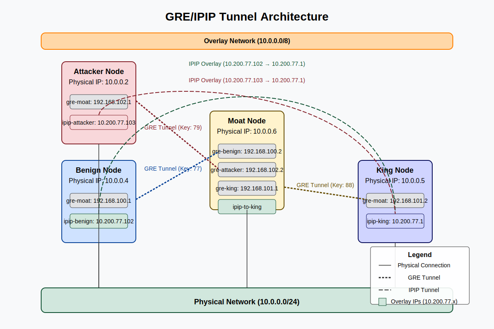

<div align="center">

# **Tensorprox: SN234** <!-- omit in toc -->
[](https://discord.gg/bittensor)
[](https://opensource.org/licenses/MIT)

---

### The Incentivized DDoS Scrubbing Center <!-- omit in toc -->

[Discord](https://discord.gg/bittensor) • [Taostats](https://taostats.io/) •

</div>

---

This repository is the **official codebase for Bittensor Subnet 234 (SN234) v0.1.0+**. To learn more about the Bittensor project and the underlying mechanics, [read here.](https://docs.bittensor.com/)


<div align="center">

**[Validator Instructions](./assets/validator.md)** · **[Miner Instructions](./assets/miner.md)**

</div>

# Introduction

Tensorprox introduces a unique approach for **DDoS protection**, featuring an distributed architecture with an innovative incentive mechanism leveraged by the Bittensor Network. The validation process uses **synthetic traffic generation**, alternating between normal and malicious network behaviors to simulate comprehensive attack scenarios. The project aims to evolve into a **global cybersecurity solution** addressing the most challenging security vectors.

# Core Concept

The subnet operates on a unique distributed network architecture where:
- **Validators** challenge miners by simulating real-world DDoS scenarios
- **Miners** provide DDoS protection services using custom routing firewall systems built with AF_XDP (Advanced Forwarding eXpress Data Path)
- Performance is evaluated through comprehensive **traffic analysis**


# Validation Round Lifecycle

1. **Availability Check**
   - Query miners for machines' availability
   - Filter and select responsive miners

2. **Initial Setup**
   - Establish session keys
   - Prepare machines for lockdown

3. **Lockdown**
   - Prevent external interference
   - Ensure controlled testing conditions

4. **Generic Routing Encapsulation (GRE)**
   - Creates an isolated, controlled network playground
   - Provides a sandboxed environment for attack vector research

5. **Challenge Execution**
   - Generate synthetic traffic scenarios including complex DDoS attack patterns
   - Test miner's protection capabilities

6. **Revert**
   - Restore original machine configurations
   - Clean up test environments


# Restricted Validator Access: Whitelist-Agent Mechanism

## Access Control Architecture

Tensorprox implements a restrictive security model to ensure validators can only execute predefined commands during the validation process. This is achieved through a custom `whitelist-agent` mechanism that provides granular control over remote command execution.

### Key Security Features

1. **Restricted User Creation**
   - Each miner creates a dedicated system user with limited privileges
   - SSH access is confined to a single, purpose-specific user account

2. **Command Whitelist**
   - Only pre-approved commands can be executed remotely
   - Strict allowlist prevents unauthorized command execution
   - Supported commands are explicitly defined in `/etc/whitelist-agent/allowlist.txt`

3. **Validated Command Execution**
   - Every SSH command undergoes comprehensive validation
   - Command paths are normalized and checked against the allowlist
   - Unauthorized commands are immediately rejected

### Allowed Commands Example

The whitelist includes only essential commands for the validation process:
- SSH connection maintenance
- Specific scripts needed for the full round execution:
  - `initial_setup.sh`
  - `challenge.sh`
  - `lockdown.sh`
  - `revert.sh`
  - `gre_setup.py`
  - `traffic_generator.py`

### Security Workflow

1. Validator initiates SSH connection
2. `whitelist-agent` intercepts the connection
3. Proposed command is checked against allowlist
4. Command is either:
   - Executed if whitelisted
   - Rejected if not authorized


**Note**: Miners must run the `restrict.sh` script on all remote machines before joining the network for security reasons.
Always conduct thorough security audits and testing in controlled environments before network deployment.


# Security Guarantees

- **Principle of Least Privilege**: Miners expose only required functionality
- **No Direct Shell Access**: Prevents interactive shell sessions
- **Script Integrity Verification**: Validators ensure the integrity of scripts like initial_setup.sh, challenge.sh, lockdown.sh, revert.sh, gre_setup.py, and traffic_generator.py by performing SHA-256 checksum comparisons before execution. This prevents unauthorized modifications by miners, ensuring that only validated scripts are executed during the validation process.


# Technical Highlights

## Dynamic Miner Selection
- Implements a time-synchronized random shuffling technique
- Uses universal timestamp-based seed to generate deterministic, unpredictable miner distributions
- Asynchronous aiohttp-based validator readiness checks ensure real-time network mapping
- **Guarantees Mutual Exclusivity**: mathematically ensures zero miner subset overlap across all active validators

## Epoch Management

- Periodic validation cycles
- Synchronized across all validators

# Reward Mechanism

## Overview

The reward mechanism is a sophisticated scoring system that evaluates miners' performance in DDoS protection based on multiple critical metrics.

### Reward Calculation Components

The reward function is composed of four key metrics:

1. **Attack Detection Accuracy (ADA)** - 30% Weight
   - Measures the ability to detect and block malicious traffic
   - Calculated as: `(Total Attack Packets - Attacks Reaching King) / Total Attack Packets`

2. **False Positive Rate (FPR)** - 30% Weight
   - Evaluates precision in distinguishing between benign and malicious traffic
   - Calculated as: `1 - (Total Benign Packets - Benign Packets Reaching King) / Total Benign Packets`

3. **Throughput Efficiency** - 20% Weight
   - Measures capacity to handle network traffic
   - Normalized total packets sent relative to maximum packets processed

4. **Latency Factor** - 20% Weight
   - Assesses response time and network performance
   - Calculated using normalized Round-Trip Time (RTT)

### Scoring Method

The final reward is calculated using a weighted sum:

```
Reward = (0.3 * Attack Detection Accuracy) + 
         (0.3 * False Positive Rate) + 
         (0.2 * Normalized Packets Sent) + 
         (0.2 * Normalized RTT)
```

# ANNEX

## GRE/IPIP Tunnel Architecture





### Network Architecture Overview

The Tensorprox system employs a sophisticated network topology utilizing GRE tunnels to create a secure, flexible overlay network. The architecture consists of four interconnected nodes within the 10.0.0.0/24 physical network, establishing a complex tunnel infrastructure.

#### Network Nodes

1. **Benign Node (10.0.0.4)**
   - Physical interface on 10.0.0.0/24 network
   - GRE tunnel to Moat (gre-moat: 192.168.100.1/30)
   - IPIP tunnel (ipip-benign) with overlay IP: 10.200.77.102/32

2. **Attacker Node (10.0.0.2)**
   - Physical interface on 10.0.0.0/24 network
   - GRE tunnel to Moat (gre-moat: 192.168.102.1/30)
   - IPIP tunnel (ipip-attacker) with overlay IP: 10.200.77.103/32

3. **Moat Node (10.0.0.6)**
   - Physical interface on 10.0.0.0/24 network
   - Multiple GRE tunnels:
     * To Benign (gre-benign: 192.168.100.2/30)
     * To Attacker (gre-attacker: 192.168.102.2/30)
     * To King (gre-king: 192.168.101.1/30)
   - IPIP tunnel to King for encapsulation

4. **King Node (10.0.0.5)**
   - Physical interface on 10.0.0.0/24 network
   - GRE tunnel to Moat (gre-moat: 192.168.101.2/30)
   - IPIP tunnel (ipip-king) with overlay IP: 10.200.77.1/32

### Traffic Flow Mechanics

#### Benign to King Traffic Flow
1. Traffic originates from Benign (10.200.77.102) to King (10.200.77.1)
2. Routed via gre-moat interface
3. Encapsulated in GRE and sent to Moat
4. Moat receives on gre-benign interface
5. Forwarded through gre-king to King
6. King processes packet through ipip-king interface

#### Attacker to King Traffic Flow
1. Traffic originates from Attacker (10.200.77.103) to King (10.200.77.1)
2. Routed via gre-moat interface
3. Encapsulated in GRE and sent to Moat
4. Moat receives on gre-attacker interface
5. Forwarded through gre-king to King
6. King processes packet through ipip-king interface

### Key Architectural Features

1. **Multi-level Encapsulation**
   - IPIP tunnels provide custom overlay network addressing
   - GRE tunnels secure and direct traffic between nodes

2. **Advanced Routing Priorities**
   - Specific routes for known endpoints (10.200.77.x) with metric 100
   - Flexible overlay network routing (10.0.0.0/8)

3. **Security Isolation**
   - GRE keys ensure traffic separation and authentication
   - Distinct IP subnets for tunnel pairs

4. **Network Flexibility**
   - 10.0.0.0/8 routing allows dynamic IP additions
   - Scalable overlay network configuration

### Kernel Optimization Techniques

To maximize network performance, the system implements:
- IP forwarding enablement
- Reverse path filtering disablement
- Increased TCP buffer sizes
- BBR congestion control
- MTU optimization to minimize fragmentation

# Contribution

We welcome contributions! Detailed guidelines will be published soon.

# License

Licensed under the **Creative Commons Attribution-NonCommercial 4.0 International (CC BY-NC 4.0)**.

## Licensing Terms
- Non-commercial use permitted
- Commercial use restricted to mining/validating within TensorProx subnet
- Commercial licensing requests: Contact **Shugo LTD**

# Contact

Join our [Discord](https://discord.gg/bittensor) for community support and discussions.

---

**Disclaimer**: Tensorprox is an experimental DDoS mitigation network. Always conduct thorough testing in controlled environments.